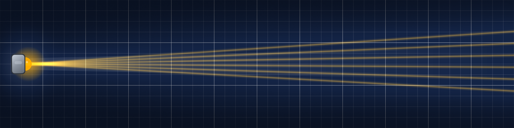
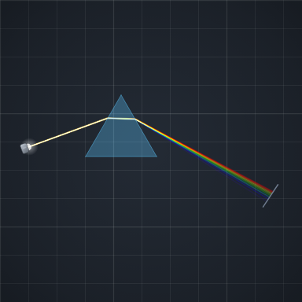
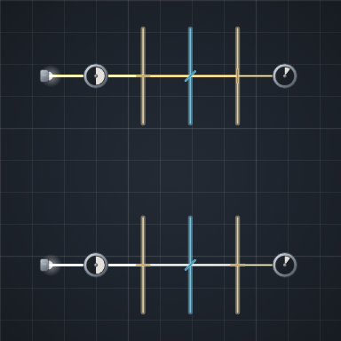
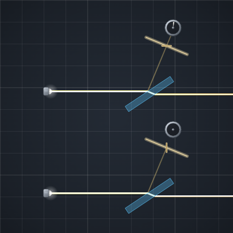
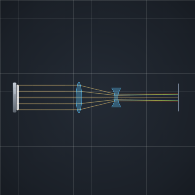
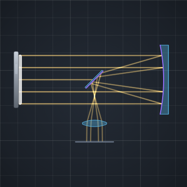
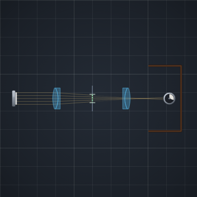
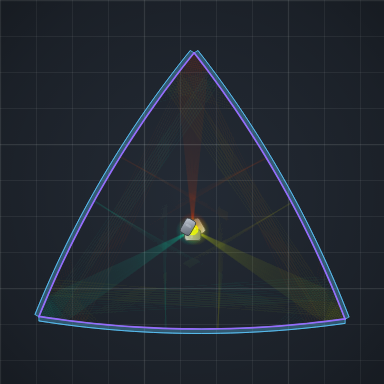

# Loomrume

  

Loomrume is a 2D optical bench. You place lamps, glass, and mirrors, move them, and watch how the rays go.

A figure in a textbook is already finished — you cannot nudge the prism. In [Studio](https://www.loomrume.com/studio) you can: change one thing and see what the light does.

The picture is a computed model, not a photograph of a lab. That is usually enough to understand why a scheme behaves as it does.

  

  <a href="https://www.loomrume.com/experiments/new?template=newton-prism"><strong>Open Newton’s prism in Studio</strong></a>
  ·
  <a href="https://www.loomrume.com/studio">Studio library</a>
  ·
  <a href="https://www.loomrume.com/examples">All examples</a>
  ·
  <a href="https://www.loomrume.com/about">About</a>

That link mints a copy of the public example in your browser library, then opens it on the bench. The original stays put.

## More schemes

Each picture opens a fresh copy in Studio. The name goes to a short article.

<table>
  <tr>
    <td align="center" width="33%">
       
      <a href="https://www.loomrume.com/examples/malus-law"><strong>Malus’s law</strong></a>
    </td>
    <td align="center" width="33%">
       
      <a href="https://www.loomrume.com/examples/brewster-reflection"><strong>Brewster reflection</strong></a>
    </td>
    <td align="center" width="33%">
       
      <a href="https://www.loomrume.com/examples/galilean-telescope"><strong>Galilean telescope</strong></a>
    </td>
  </tr>
  <tr>
    <td align="center">
       
      <a href="https://www.loomrume.com/examples/newtonian-reflector"><strong>Newtonian reflector</strong></a>
    </td>
    <td align="center">
       
      <a href="https://www.loomrume.com/examples/planar"><strong>Planar</strong></a>
    </td>
    <td align="center">
       
      <a href="https://www.loomrume.com/examples/kaleidoscope"><strong>Kaleidoscope</strong></a>
    </td>
  </tr>
</table>

## Links

| | |
| --- | --- |
| Site | [loomrume.com](https://www.loomrume.com) |
| Studio | [loomrume.com/studio](https://www.loomrume.com/studio) |
| New scheme | [Newton prism, as a copy](https://www.loomrume.com/experiments/new?template=newton-prism) |
| Mail | [hello@loomrume.com](mailto:hello@loomrume.com) |

Native apps are still in progress. On a computer you can already build schemes in the browser. On a phone you can look around until the apps ship.
